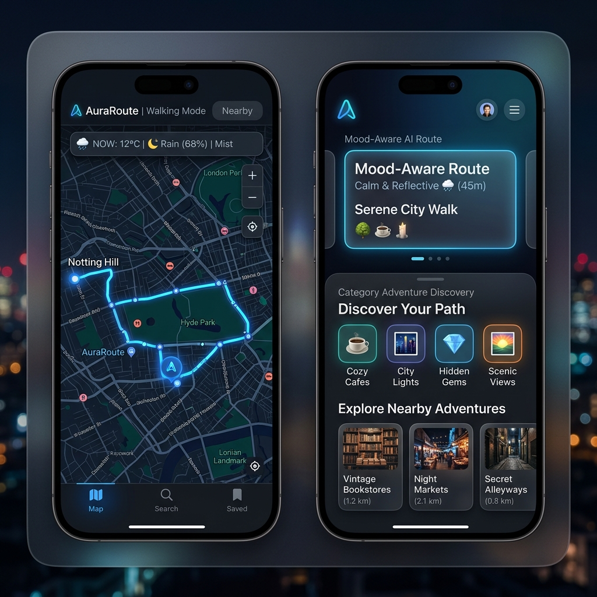

# 🌟 AuraRoute — Mood-Aware Smart Navigation & Exploration

<p align="center">
  
</p>

<p align="center">
  <a href="https://flutter.dev"></a>
  <a href="https://dart.dev"></a>
  <a href="https://groq.com"></a>
  <a href="https://openmeteo.com"></a>
  <a href="https://www.openstreetmap.org"></a>
  <a href="https://github.com/samtandon12/auraroute/blob/main/LICENSE"></a>
</p>

---

## 📌 Overview

**AuraRoute** is a modern, mood-aware navigation and exploration mobile application built with Flutter. It blends real-time location services, live weather metrics, category place discovery, and AI-driven route recommendations tailored to your current emotional state (Calm, Energetic, Adventurous, Reflective).

Whether you are looking for a peaceful walk in a nearby park, a jogging route with realistic speed ETAs, or a motorcycle ride around scenic viewpoints, AuraRoute provides an immersive dark-mode UI with full privacy protections and zero client-side API key leakage.

---

## 📸 Interface Preview

<p align="center">
  
</p>

---

## ✨ Key Features

### 🗺️ Real Place Search & Routing
* **Debounced Geocoding**: Search places and addresses instantly with 500ms debounced queries via OpenStreetMap Nominatim.
* **Multi-Mode Routing**: Turn-by-turn routing powered by the Open Source Routing Machine (OSRM) supporting:
  * 🚶 **Walk**: Walking speed route calculation.
  * 🏃 **Jog**: Speed-adjusted ETA calculations (~1.7x faster than walking).
  * 🏍️ **Motorcycle**: Driving-profile route calculation (*transparently labeled in UI as "Motorcycle-style route via Driving profile"*).
* **Live Step-by-Step Instructions**: View maneuver directions, remaining distance, and ETA updating continuously during navigation.

### 🌤️ Live Weather Context
* Integrated with **Open-Meteo REST API** to display real-time temperature, condition labels, wind speed, and precipitation metrics directly on the navigation screen.
* Weather details sheet provides outdoor friendliness recommendations.

### 🤖 Mood-Aware AI Recommendations (Groq Llama-3)
* **Secure Backend Proxy**: Flutter app communicates with an Express Node.js backend proxy ([`backend/server.js`](file:///D:/Development/AuraRoute/backend/server.js)), keeping `GROQ_API_KEY` 100% secure server-side.
* **Grounded AI Suggestions**: AI generates activity suggestions, short contextual explanations, and fun mood challenges grounded strictly in real places.
* **Graceful Local Fallback**: Automatic local fallback generator prevents app disruption if the AI server or internet is unavailable.

### 🧭 Adventure Mode & Category Discovery
* One-tap discovery of nearby **Cafes**, **Parks**, **Viewpoints**, and **Restaurants** using Nominatim POI search.
* Interactive discovery card overlay allowing users to shuffle recommendations or add intermediate stops directly as route waypoints.

### 🔖 Favorites, Privacy & History
* **SQLite Persistence**: On-device `auraroute.db` database stores saved route bookmarks, scheduled reminders, and completed walk history.
* **Privacy-Aware Sharing**: Generate journey summaries (distance, duration, mood) to share socially without exposing private home or start coordinates.
* **Scheduled Reminders**: Android local notifications via `flutter_local_notifications` for recurring activity schedules.

---

## 🛠️ Tech Stack & Architecture

| Layer | Technology |
| :--- | :--- |
| **Frontend Framework** | [Flutter](https://flutter.dev) (Dart 3) |
| **State Management** | [Riverpod 2.x](https://riverpod.dev) (`Notifier` & `ConsumerWidget`) |
| **Maps & Mapping** | `flutter_map` (OpenStreetMap tile renderer) & `latlong2` |
| **Geocoding & POIs** | OpenStreetMap Nominatim REST API |
| **Routing Engine** | OSRM (Open Source Routing Machine) |
| **Weather API** | Open-Meteo Forecast REST API |
| **AI Backend Proxy** | Express.js / Node.js proxy with [Groq SDK](https://groq.com) |
| **Local Database** | `sqflite` (SQLite database engine) |
| **Notifications** | `flutter_local_notifications` |

---

## 🚀 Getting Started

### Prerequisites
* [Flutter SDK](https://flutter.dev/docs/get-started/install) (v3.19+)
* [Node.js](https://nodejs.org/) (v18+)
* Android Studio / Xcode (for device/emulator execution)

### 1. Clone & Install Dependencies
```bash
git clone https://github.com/samtandon12/auraroute.git
cd auraroute

# Install Flutter dependencies
flutter pub get

# Install Backend proxy dependencies
cd backend
npm install
cd ..
```

### 2. Configure Environment Secrets
Create a `.env` file inside the `backend/` directory:
```env
PORT=3000
GROQ_API_KEY=your_groq_api_key_here
```

### 3. Launch the Backend Proxy Server
```bash
cd backend
npm start
```
*The proxy will run at `http://localhost:3000/api/recommendations`.*

### 4. Run the Mobile App
```bash
# Verify static code analysis
flutter analyze

# Launch on connected Android device or emulator
flutter run
```

---

## 📄 License

Distributed under the MIT License. See `LICENSE` for more information.
